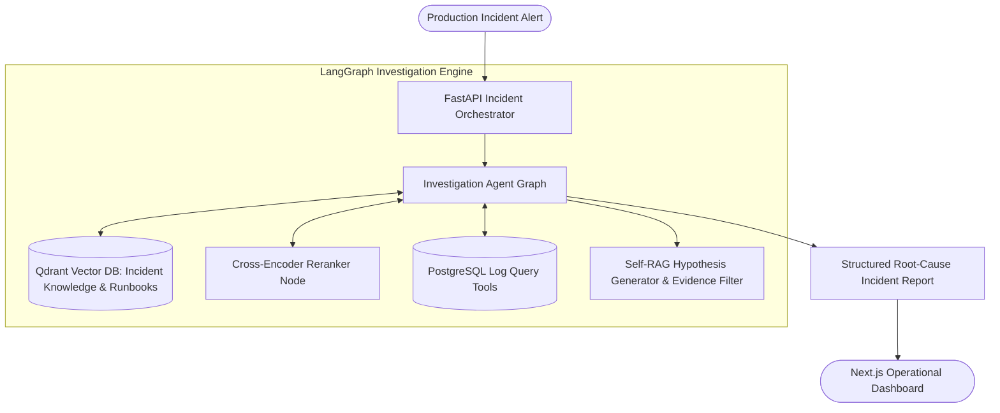

# TRACEBACK: Autonomous Root-Cause Incident Investigation Platform

An end-to-end autonomous incident response and root-cause analysis platform powered by an isolated **LangGraph Investigation Agent**, **Qdrant Vector Database**, **FastAPI**, and a **Next.js** operational dashboard.

---

## Architecture Overview



---

## Key Features

- **Autonomous Multi-Step Investigation (`langgraph_investigation_agent`):** Orchestrates multi-hop diagnostic workflows, log exploration, and historical anomaly comparison via LangGraph.
- **Incident Retrieval & Knowledge Reranking:** Integrates Qdrant vector retrieval for past runbooks with contextual reranking to isolate high-confidence incident signatures.
- **Hypothesis Generation & Self-RAG Evidence Gating:** Validates diagnostic hypotheses against raw logs before finalizing remediation suggestions.
- **Interactive Operational Dashboard:** Real-time visualization built with Next.js, Tailwind CSS, and TypeScript for site reliability engineering teams.
- **Production Containerization:** Fully containerized setup via Docker and Docker Compose.

---

## Tech Stack

- **AI & Reasoning:** LangGraph, LangChain, Qdrant Vector Store, OpenAI / Groq LLMs
- **Backend Service:** FastAPI, Uvicorn, PostgreSQL, Pydantic
- **Frontend Dashboard:** Next.js (App Router), React, TypeScript, Tailwind CSS, Lucide Icons
- **Infrastructure:** Docker, Docker Compose

---

## Getting Started

### 1. Prerequisites
- Docker & Docker Compose
- Node.js 18+ (for frontend development)
- Python 3.10+ (for backend / agent)

### 2. Quickstart with Docker Compose

```bash
git clone https://github.com/Ayyan119/TRACEBACK.git
cd TRACEBACK

cp .env.example .env
docker compose up --build
```

Access the dashboard at `http://localhost:3000` and API docs at `http://localhost:8000/docs`.

### 3. Running the Isolated Investigation Agent

```bash
cd langgraph_investigation_agent
python3 -m app.run_demo
```

---

## License

MIT License.
